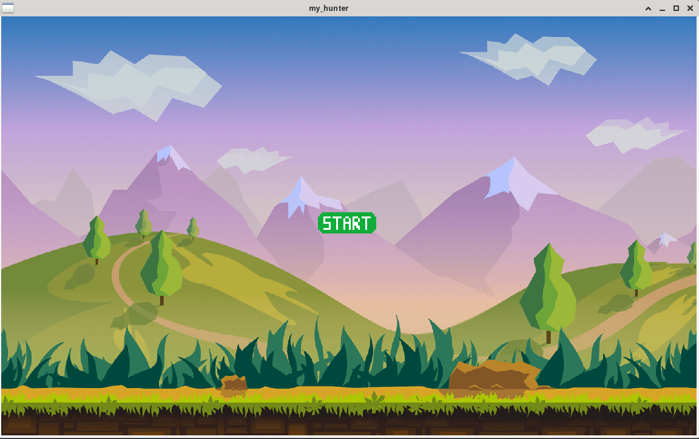
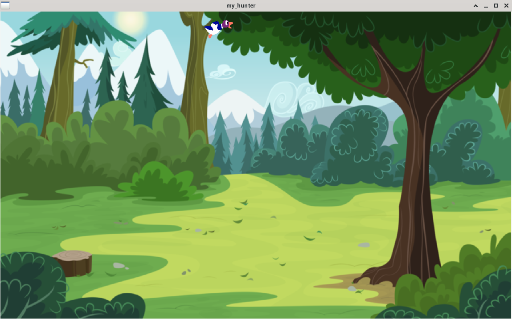

# MY_HUNTER
## Table of Contents
1. [General Info](#general-info)
2. [Technologies](#technologies)
3. [Installation](#installation)
4. [Overview](#Overview)
### General Info
***
The goal of this project is to recreate a game like a duck taffy thanks to the CSFML library
## Technologies
***
A list of technologies used within the project:
* [CSFML](https://26.customprotocol.com/csfml/index.htm)
## Installation
***
```
$ git clone git@github.com:matheo2027/MyHunter.git
$ cd MyHunter
$ make
$ ./my_hunter
```
## Overview
***


